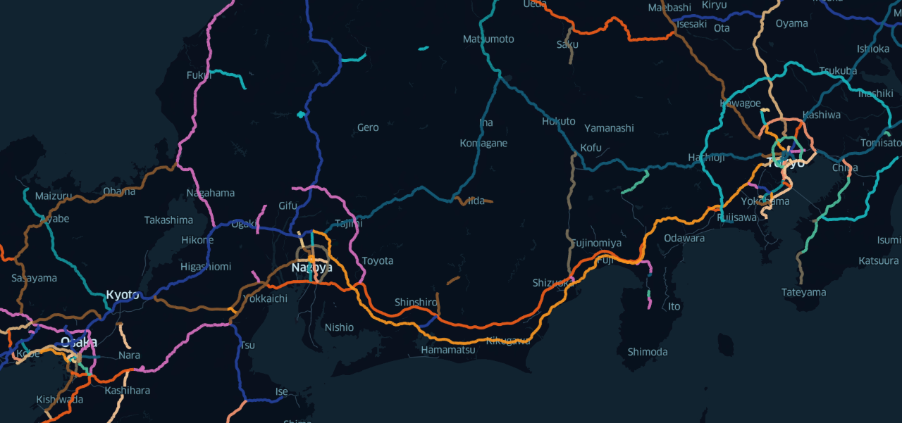

# HighwayOrderedDS
営業路線別に順序付けられた高速道路の路線データ

[国土数値情報（高速道路時系列データ）](https://nlftp.mlit.go.jp/ksj/gml/datalist/KsjTmplt-N06-v1_2.html) では路線データが法定路線名ごとに分割して提供されており、案内上利用される営業路線名別にデータを扱うことはできません。また、路線ごとのICやJCT等の順序も分かりません。

このリポジトリでは以下のものを公開します。

1. 高速道路時系列データに加え、Wikipediaの営業路線別の記事データを用いて作成した、営業路線別・順序情報付きの高速道路路線データ
2. 上述の路線データの作成を支援するスクリプト

## データセットの内容

| ファイル名                                                   | 説明                                                         |
| ------------------------------------------------------------ | ------------------------------------------------------------ |
| [highway_point.geojson](data/highway_point.geojson)          | IC, JCT, SA, PA の位置、所属する路線、順序等のデータ。       |
| [highway_path.geojson](data/highway_path.geojson)            | 路線区間の位置、所属する路線、順序等のデータ。               |
| [length.json](data/length.json)                              | 推定した各路線の路線延長。                                   |
| [N06-20_Joint_fixed.geojson](data/N06-20_Joint_fixed.geojson) | IC, JCTの位置等のデータ。 高速道路時系列データを一部手で加工して作成。 |
| [N06-20_HighwaySection_fixed.geojson](data/N06-20_HighwaySection_fixed.geojson) | 路線区間の位置等のデータ。 高速道路時系列データを一部手で加工して作成。 |

## 特徴

このリポジトリで公開するデータセットは、もとにした高速道路時系列データおよびWikipediaの記事データと比較して、下表のとおりの特徴を持ちます。

|                 | 高速道路時系列データ | Wikipediaの記事データ | HighwayOrderedDS |
| --------------- | -------------------- | --------------------- | ---------------- |
| 路線の分類      | 法定路線名別         | 営業路線名別          | 営業路線名別     |
| ジオメトリ情報  | ◯                    | ✕                     | ◯                |
| IC等の順序情報  | ✕                    | ◯                     | ◯                |
| SA/PAの位置情報 | ✕                    | △ (※1)                | △ (※1)           |
| 完全性          | ◯                    | △                     | △                |

※1 Wikipediaの記事データのうちキロポストの情報を用いて、前後のIC/JCT等の位置情報から補間することでSA/PAの位置を推定している。このため施設間の順序は正確だがその位置はやや不正確である。

## 原典資料

* 「国土数値情報（高速道路時系列データ）」（国土交通省）（ https://nlftp.mlit.go.jp/ksj/gml/datalist/KsjTmplt-N06-v1_2.html ）を加工して作成。
  * 国土数値情報（高速道路時系列データ）は、CC-BY 4.0と互換性を持つ、国土数値情報ダウンロードサイトコンテンツ利用規約（政府標準利用規約準拠版）によって公開されている。
* 「日本の高速道路一覧 - Wikipedia」（ https://ja.wikipedia.org/wiki/%E6%97%A5%E6%9C%AC%E3%81%AE%E9%AB%98%E9%80%9F%E9%81%93%E8%B7%AF%E4%B8%80%E8%A6%A7 ）および、当該ページからリンクされた各路線の記事 を加工して作成。
  * Wikipediaの文章素材は CC-BY-SA 3.0 に従った二次利用が認められている。

## ライセンス

データセットは CC-BY-SA 3.0 にて、ソースコードは MIT License にて公開される。

## UDC

本作品は [アーバンデータチャレンジ（UDC）2021](https://urbandata-challenge.jp/2021submitstart) に参加します。
